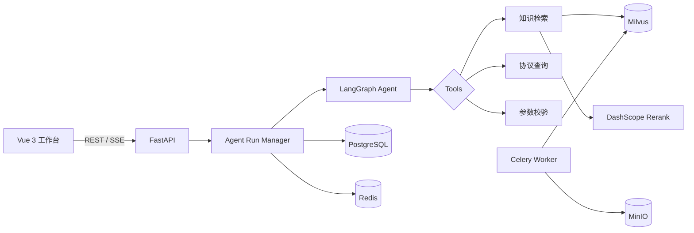

# CryptoPilot

面向密码学论文、协议规范和安全定义的可审计 Agentic RAG 系统。

CryptoPilot 将分散的密码学资料统一解析并写入知识库，由 Agent 根据问题自主选择知识检索、协议查询和参数校验工具，完成多步骤分析。每次执行都以持久化 Run/Event 记录，可通过 SSE 实时观察、断线续传、超时终止和主动取消。

> 项目正在持续开发。README 中“已实现”的能力均已有对应代码；尚未完成的内容统一放在路线图中，不以规划冒充实现。

## 核心能力

- **密码协议分析 Agent**：基于 LangGraph 实现有界的 Model → Tool → Model 循环，支持并行工具调用和最大步数保护。
- **专业工具集**：提供知识库检索、协议速查和密码参数校验，可识别 RSA 短密钥、弱哈希、AEAD Nonce 重用等常见风险。
- **RAG 知识库**：支持 PDF、DOCX、XLSX、PPTX、Markdown、HTML、TXT 等文档解析、切分、Embedding、Milvus 检索与 Rerank。
- **可恢复执行**：Run、配置快照和递增 Event 持久化到 PostgreSQL；SSE 支持 `Last-Event-ID` 重放。
- **异步与取消**：HTTP 请求不阻塞 Agent 长任务，支持执行超时和服务端真实取消，而不只是关闭浏览器连接。
- **上下文记忆**：Redis 管理带 TTL 的短期窗口；独立 Milvus Collection 保存按用户隔离的长期记忆，并拒绝疑似密钥和凭据。
- **可视化工作台**：Vue 3 页面支持 Agent 配置、直接运行、工具轨迹查看、结果展示和停止执行。
- **容器化部署**：Docker Compose 编排 PostgreSQL、Redis、Milvus、MinIO、RabbitMQ、Celery Worker 和应用服务。

## 系统架构



职责边界：

| 组件 | 职责 |
|---|---|
| PostgreSQL | 用户、知识库、Agent 配置、Run、Event 和最终结果 |
| Redis | 短期记忆、运行状态缓存和 TTL 数据 |
| Milvus | 文档向量检索，以及与文档集合隔离的用户长期记忆 |
| MinIO | 上传的原始文档 |
| RabbitMQ / Celery | 文档解析、向量化等异步任务 |

## 技术栈

| 层级 | 技术 |
|---|---|
| Agent | LangChain、LangGraph、Tool Calling |
| Backend | Python 3.10+、FastAPI、SQLAlchemy、Pydantic |
| Database | PostgreSQL 16、Redis 7 |
| Retrieval | Milvus、DashScope Embedding、DashScope Rerank |
| Async | asyncio、SSE、Celery、RabbitMQ |
| Storage | MinIO |
| Frontend | Vue 3、Element Plus、Pinia、Vite |
| Deployment | Docker Compose |

## 快速启动

### 1. 克隆与配置

```bash
git clone https://github.com/guttar/CryptoPilot.git
cd CryptoPilot
cp .env.example .env
```

在 `.env` 中至少填写：

```env
SECRET_KEY=<随机且足够长的字符串>
DASHSCOPE_API_KEY=<你的 DashScope API Key>
```

不要把真实 `.env`、API Key 或数据库密码提交到仓库。

### 2. 启动基础设施

```bash
docker compose -f docker/docker-compose.yml up -d
```

默认包含 PostgreSQL、Redis、RabbitMQ、MinIO 和 Milvus。

### 3. 启动后端

```bash
python -m venv .venv

# Linux / macOS
source .venv/bin/activate

# Windows PowerShell
.venv\Scripts\Activate.ps1

pip install -r requirements.txt
uvicorn src.main:app --host 0.0.0.0 --port 8000 --reload
```

API 文档：<http://localhost:8000/docs>

### 4. 启动文档 Worker

```bash
celery -A src.worker.celery_app worker --loglevel=info
```

Windows 本地开发可追加 `-P solo`。

### 5. 启动前端

```bash
cd frontend
npm install
npm run dev
```

前端地址：<http://localhost:5173>

## Agent 执行接口

创建持久化运行：

```http
POST /api/v1/agents/{agent_id}/runs
Authorization: Bearer <token>
Content-Type: application/json

{
  "question": "分析 TLS 1.3 密钥派生流程，并检查 RSA-1024 与 SHA-1 的风险"
}
```

观察运行事件：

```http
GET /api/v1/agents/executions/{run_id}/stream
Authorization: Bearer <token>
Accept: text/event-stream
Last-Event-ID: 3
```

取消运行：

```http
POST /api/v1/agents/executions/{run_id}/cancel
Authorization: Bearer <token>
```

典型事件包括：

```text
run.started
agent.thinking
tool.started
retrieval.started
retrieval.completed
tool.completed
run.completed | run.failed | run.timed_out | run.cancelled
```

## 目录结构

```text
CryptoPilot/
├── src/
│   ├── api/routers/          # REST 与 SSE 接口
│   ├── database/             # SQLAlchemy 模型、PostgreSQL 会话
│   ├── embedding/            # Embedding 适配器
│   ├── retrieval/            # Milvus 检索与 Rerank
│   ├── services/
│   │   ├── agent_service.py      # LangGraph Agent
│   │   ├── agent_run_manager.py  # Run 生命周期、超时、取消、事件
│   │   ├── crypto_tools.py       # 协议与参数安全工具
│   │   ├── rag_service.py        # RAG 主流程
│   │   └── memory_service.py     # Redis 会话记忆
│   └── worker/               # Celery 文档处理任务
├── frontend/                 # Vue 3 工作台
├── docker/                   # Dockerfile 与 Compose
├── tests/                    # 自动化测试
└── docs/                     # API 文档
```

## 测试与构建

```bash
python -m unittest discover -s tests -v

cd frontend
npm run build
```

当前已覆盖密码协议别名、未知协议、RSA 弱密钥、AEAD Nonce 重用、RAG 引用、用户记忆隔离和秘密信息拒绝等测试；后续将持续补充 Agent、API、数据库与故障恢复测试。

## 路线图

- [x] LangGraph 多步 Agent 与专业工具
- [x] PostgreSQL Run/Event 持久化
- [x] 可重放 SSE、超时和主动取消
- [x] Redis 短期会话记忆
- [x] Milvus 向量检索与 Rerank 基础链路
- [ ] Dense + BM25 混合召回与 RRF 融合
- [ ] 面向论文/协议/RFC 的结构化元数据抽取
- [x] 用户隔离的长期记忆集合、语义召回与秘密信息保护
- [ ] Agent Run 故障恢复和多 Worker 调度
- [ ] 密码学评测集、引用正确率与安全结论评估
- [ ] Alembic 迁移、CI 和生产安全加固

## 安全说明

CryptoPilot 用于辅助研究和安全分析，不替代密码学专家评审、正式标准文本、合规审计或经过验证的密码库。参数校验工具只检查常见风险，不能证明一个协议或实现安全。

## License

[MIT](LICENSE)
